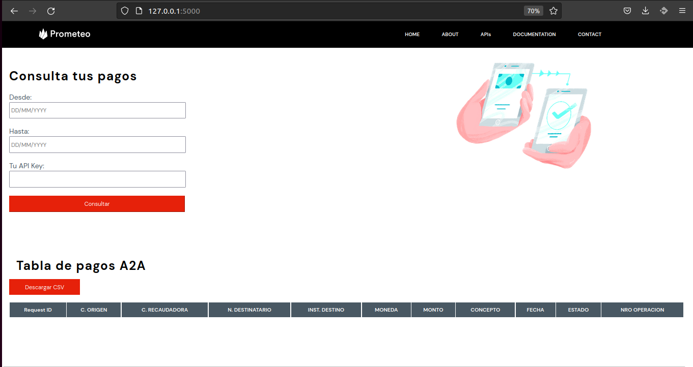
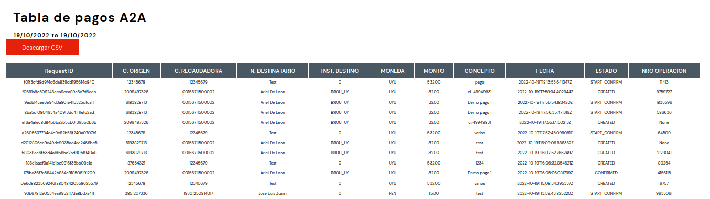
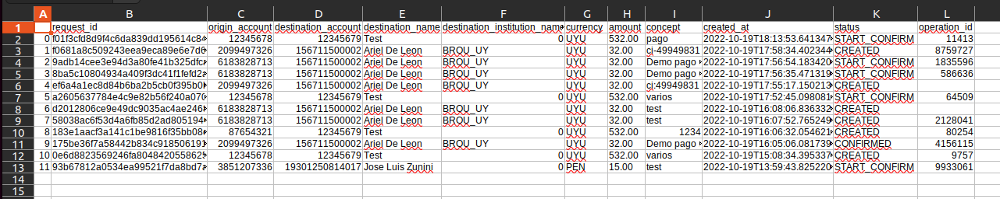

# transfer_logs_web_flask

### Run
```
source env/bin/activate
```
```
pip install -r requirements.txt
```
```
cd app
```
```
export FLASK_APP=app
```
```
export FLASK_ENV=development
```
```
flask run
```

### Docu - Examples

*Home*


*Table example*


*Exp CSV example*

